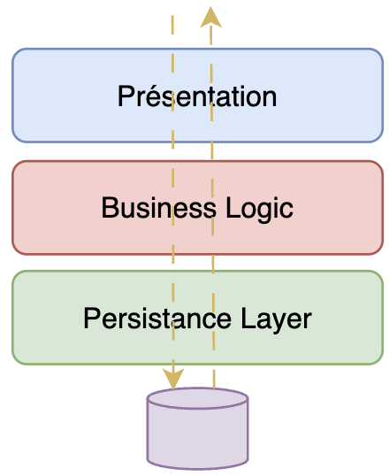

:::ressources
- [Lasagna code - too many layers?](https://matthiasnoback.nl/2018/02/lasagna-code-too-many-layers/)
- [Layered Architecture - Dernière section](https://herbertograca.com/2017/08/03/layered-architecture/)
:::

## Sinkhole/Lasagne anti-pattern

Cet anti-pattern est fortement lié à l'architecture Layered. En effet, le principal risque dans cette architecture est qu'une requête traverse toutes les couches sans qu'aucune logique métier (*business logic*) n'ait été appliquée.

Par conséquent, l'entité de la base de données est remontée directement à la couche de présentation. Or, cette entité en base de données contient peut-être plus d'informations que nécessaires à la vue.
