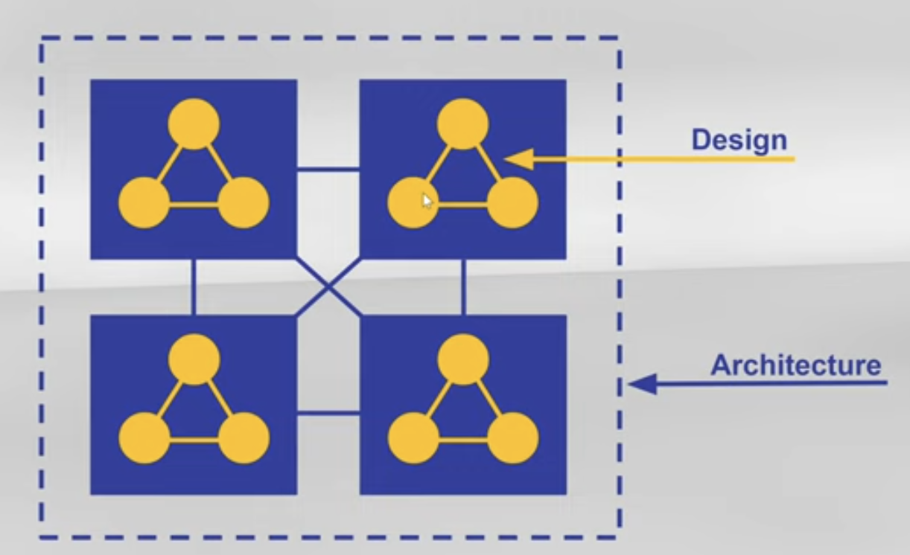

:::ressources
- [ Software Design Introduction - 3:56 minutes](https://youtu.be/wfQ_ZLttsPM)
:::

Jakob Jenkov considère que l'Architecture Logicielle se concentre sur la structure entre les composants, tandis que la Conception Logicielle concerne la structure interne d'un composant.

