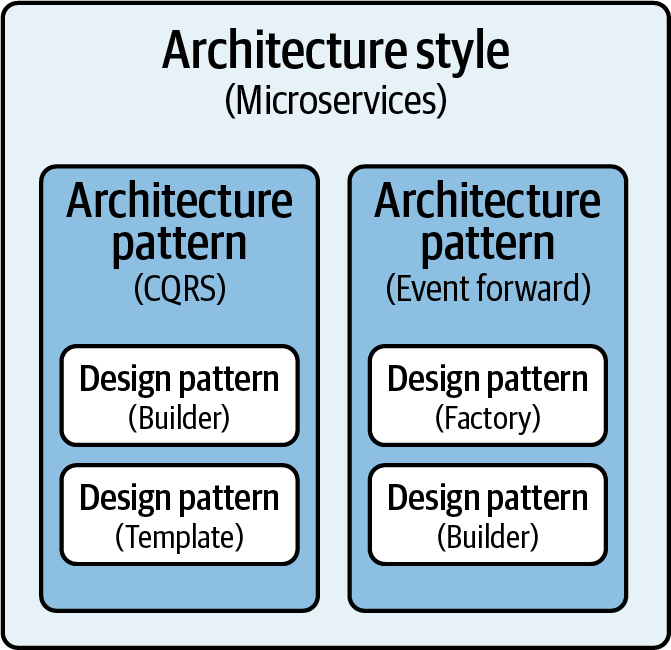

> The architecture of a software system is almost never limited to a single architectural style, but is often a combination of architectural styles that make up the complete system. [^1]

Par exemple, pour développer une application web la [Separation des préoccupations](../../../concepts-fondamentaux/separation_of_concern) peut se faire en introduisant une architecture en couche. Cela permet d’isoler la logique de présentation, la logique métier et d’accès aux données.
Ensuite, selon les exigences de sécurité, le déploiement peut se faire en trois niveaux ou plus. Le niveau de présentation peut être déployé sur le réseau périphérique, qui se situe entre le réseau interne d'une organisation et un réseau externe.
Finalement pour implémenter la couche de présentation on peut utiliser la patron MVC, et pour la logique métier une architecture hexagonale par exemple.

L'illustration ci-dessous montre un autre exemple 
> For example, you can use the Builder design pattern as a way to implement the CQRS architecture pattern, and then use the CQRS pattern as a building block within a microservices architecture. [^2]

[^1]: [The architecture of a software system is almost never limited to a single architectural style, but is often a combination of architectural styles that make up the complete system.](https://learn.microsoft.com/en-us/previous-versions/msp-n-p/ee658117(v=pandp.10)#combining-architectural-styles)

[^2]: https://www.oreilly.com/library/view/software-architecture-patterns/9781098134280/ch01.html
