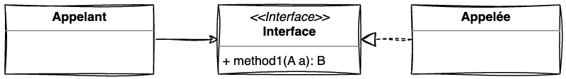
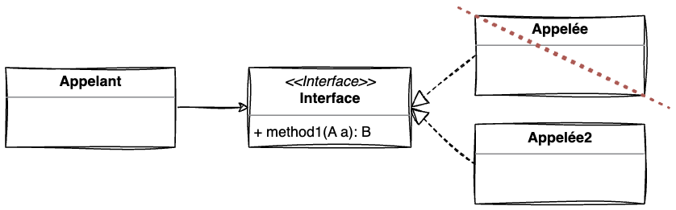

:::ressources
- [MUST READ : Design Principles from Design Patterns A Conversation with Erich Gamma, Part III](https://www.artima.com/articles/design-principles-from-design-patterns)
:::

Comme vu dans [Abstraction vs Indirection](./aei/abstraction_indirection.md), une interface n'est pas automatiquement une abstraction utile : elle peut aussi n'être qu'un simple niveau d'indirection supplémentaire.

Une interface permet de définir un ensemble de services qu’un client peut obtenir d’un objet :
- Elle définit les méthodes (i.e. service) qui vont pouvoir être appelées
- Elle définit les informations que doit fournir l'appelant (ex : paramètre de la méthode)
- Elle définit les informations que l'appelant va obtenir (ex : type de retour)
 

Pour communiquer avec l'`Appelé` la classe `Appelant` devra respecter le contrat édité dans l'interface `Interface`.
- `Appelant` devra fournir un objet de type `A` 
- `Appelant` recevra du service un objet de type `B`

## Changer l'implémentation
> Once you depend on interfaces only, you're decoupled from the implementation. That means the implementation can vary, and that's a healthy dependency relationship

=> Donc, une interface permet **d'avoir un couplage faible entre l'appelant et l'appelé**.

Grâce à cette conception, si nous décidons de changer la classe `Appelée` par `Appelée2`, l'appelant n'aura ni besoin d'être recompilé, ni redéployé, car il a seulement connaissance de l'interface et non de l'implémentation concrète. Cet avantage vient ici surtout de l'**indirection** : l'appelant dépend d'un contrat intermédiaire plutôt que d'une classe concrète.

## Citation de la ressource

> In Java when you add a new method to an interface, you break all your clients. When you have an abstract class, you can add a new method and provide a default implementation in it. All the clients will continue to work.

> Imagine I define an interface with five methods, and I define an implementation class below that implements these five methods and adds another ten methods. If only the interface is published as API then if you call one of these ten methods you make an internal call. You call a method that is out of contract, which I might break anytime. So it's the difference, as Martin Fowler would say, between public and published. **Something can be public, but that doesn't mean you have published it.**
