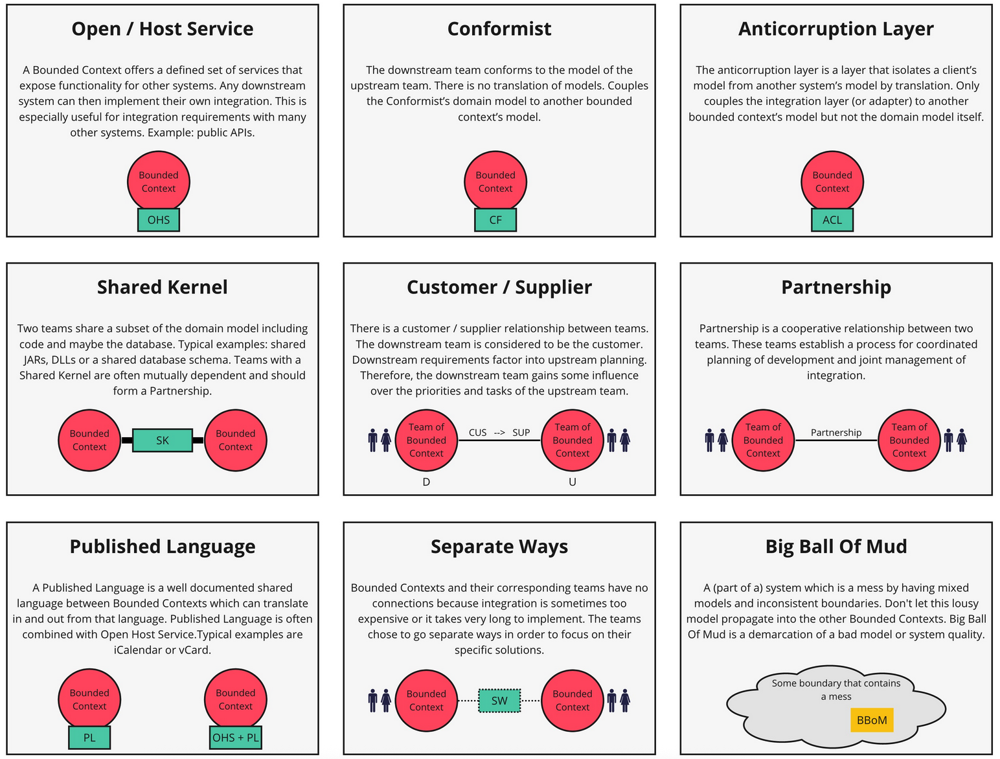

:::ressources
- Chapitre 4 - Learning Domain Driven Design
- Blue Book page 352
- [Différents types de relation](https://github.com/ddd-crew/context-mapping)
:::

Malgré que les Bounded Context sont indépendants ils doivent interagir les uns avec les autres. Il existe plusieurs patterns permettant d'assurer la communication entre plusieurs Bounded Context

