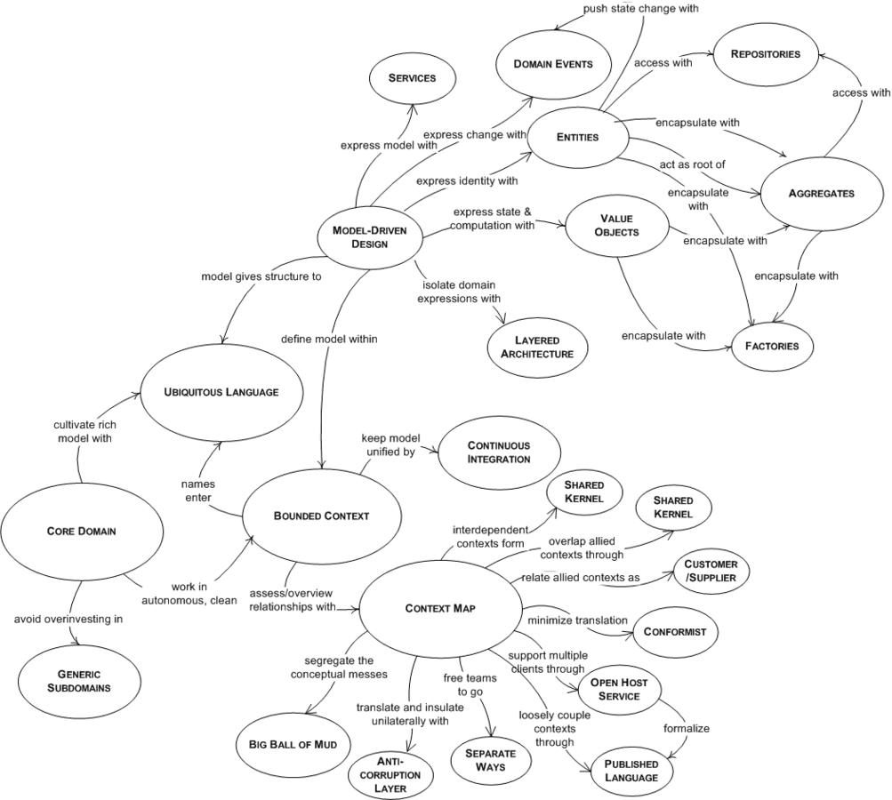

:::ressources
- [Learning Domain-Driven Design - Aligning Software Architecture and Business Strategy ](https://www.oreilly.com/library/view/learning-domain-driven-design/9781098100124/)
- [This Is How Domain-Driven Design Makes Object-Oriented Design More Powerful](https://youtu.be/W2OobtTQo9Y)
- [An Introduction to Domain Driven Design](https://www.methodsandtools.com/archive/archive.php?id=97)
- [DDD Sample](https://dddsample.sourceforge.net/characterization.html)
- [Serie d'article sur les concepts du DDD](https://blog.sapiensworks.com/tags.html)
- [Ensemble d'articles de CodeOpinion](https://codeopinion.com/category/domain-driven-design/)
:::

:::ressources[Projets Github]
- [DDD Exemple Java - GitHub](https://github.com/ddd-by-examples/library)
- [DDD Welcome - GitHub](https://github.com/ddd-crew/welcome-to-ddd)
- [Domain-Driven Hexagon (github)](https://github.com/Sairyss/domain-driven-hexagon?tab=readme-ov-file#application-services)
- [Modular-monolith-with-ddd (github)](https://github.com/kgrzybek/modular-monolith-with-ddd)
:::

